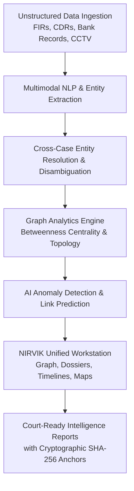

# NIRVIK — AI-Powered Criminal Network Intelligence Platform

<div align="center">
  
  <h1>NIRVIK</h1>
  <h3>AI-Powered Criminal Network Intelligence & Investigation Decision-Support System</h3>
  <p><i>Architected, Designed, and Implemented by <b>Rishabh Shevde</b></i></p>

  <p>
    
    
    
    
    
    
    
  </p>
</div>

---

## 📖 Table of Contents
1. [Project Overview & Problem Statement](#-project-overview--problem-statement)
2. [Key Capabilities & Solution Architecture](#-key-capabilities--solution-architecture)
3. [What Rishabh Has Done (Detailed Contributions)](#-what-rishabh-has-done-detailed-contributions)
4. [Design System & 4-Color Palette](#-design-system--4-color-palette)
5. [Complete Module & Workspace Breakdown](#-complete-module--workspace-breakdown)
6. [Interactive Components (Cytoscape Graph & Leaflet Map)](#-interactive-components)
7. [Ethical AI, Legal Compliance & Privacy Shielding](#-ethical-ai-legal-compliance--privacy-shielding)
8. [Technology Stack](#-technology-stack)
9. [Project Directory Structure](#-project-directory-structure)
10. [Getting Started & Local Setup](#-getting-started--local-setup)
11. [Evaluator & Demo Scripts](#-evaluator--demo-scripts)

---

## 🎯 Project Overview & Problem Statement

Modern criminal syndicates operate across fragmented jurisdictions and utilize sophisticated operational security. They mask illicit activities through:
- Layered commercial shell companies with nominee directors.
- High-velocity rotating burner handsets and IMEIs.
- Dispersed Hawala networks and structured wire transfers.
- Multi-jurisdictional logistics routes exploiting state boundary handoffs.

### The Problem
Traditional law enforcement intelligence is siloed across disparate state databases, unstructured First Information Reports (FIRs), call detail logs (CDRs), and banking statements. Investigators spend hundreds of manual hours cross-referencing files, frequently missing the **intermediary bridge entities** that hold criminal operations together.

### The NIRVIK Solution
**NIRVIK** is an AI-powered criminal network intelligence workstation engineered specifically for law enforcement analysts, crime branch investigators, and command personnel. NIRVIK autonomously ingests multi-modal evidence, resolves entities across cases, calculates structural graph centrality, highlights anomalies, and assists investigators in building court-ready, cryptographically verifiable dossiers.

---

## 🏗️ Key Capabilities & Solution Architecture



1. **Topological Graph Intelligence**: Dynamic network graphs with physics-based layout engines, centrality scoring (Betweenness, Degree, Closeness), and one-click intermediate network expansion.
2. **NLP Document Intelligence**: Automated entity extraction (Persons, Organizations, Locations, Vehicles, Weapons) from raw FIRs and interrogation transcripts with confidence ratings.
3. **Cross-Case Linkage**: Automated detection of shared infrastructure (e.g., a phone number active in Case 2026-0142 that was previously logged in closed Hawala Case 2025-0891).
4. **Explainable AI (XAI)**: Every anomaly flag and deduction is accompanied by an *Explainability Matrix* and direct citations to physical evidence files.
5. **Cryptographic Chain of Custody**: Every evidence item and audit action is timestamped and anchored with SHA-256 cryptographic verification.
6. **Privacy-Shielded Analysis**: Built-in compliance with Criminal Justice Code §228A for sensitive victim protection in women safety modules.

---

## 👨‍💻 What Rishabh Has Done (Detailed Contributions)

**Rishabh Shevde** served as the lead frontend and systems architect for NIRVIK, spearheading the complete design system engineering, technical architecture, component development, and data modeling from scratch:

### 1. End-to-End System & Frontend Architecture
- **Architecture**: Designed a modular, decoupled Single Page Application (SPA) using **React 18/19, TypeScript, and Vite**, ensuring sub-second route transitions, strict type safety, and zero reliance on heavy external backend dependencies for demonstrations.
- **Service Layer**: Constructed an asynchronous, domain-driven service layer (`src/services/`) abstracting all case, entity, graph, alert, document, evidence, and audit telemetry.
- **State Management**: Created centralized React Contexts (`AuthContext`, `CaseContext`) for session management, global case switching, active graph node selection, and modal lifecycle control.

### 2. Implementation of 13 Canonical Workspace Screens
- Transformed 13 Google Stitch screen specifications into fully interactive, responsive, pixel-perfect production components:
  1. `LoginPage`: Officer badge authentication with fast-access demo presets (`Rajiv Kumar`, `S. Lee`).
  2. `DashboardPage`: Executive KPI bento grid, attention-required feed, and active investigations ledger.
  3. `InvestigationsPage`: Multi-filter investigation repository with instant search.
  4. `CaseDetailPage`: Operation Shadow synopsis, interactive mini linkage topology, and verified sources.
  5. `NetworkAnalysisPage`: Core graph workspace featuring the Cytoscape canvas, layout switcher, confidence threshold slider, and right-hand inspector.
  6. `EntityProfilePage`: Detailed target dossier (Ramesh Kumar, UID-8842-A) with 0.84 Centrality rating, Explainability Matrix, 87% Confidence gauge, and Human Verification Action Block.
  7. `IntelligenceSearchPage`: Natural language search with query chips, category filtering, and split-pane inspector.
  8. `AlertsPage`: Real-time anomaly detection cards with severity filters and direct graph pivots.
  9. `DataSourcesPage`: Active integration status (CCTNS, Telecom, FIU) + Interactive 5-step animated ingestion pipeline simulator.
  10. `DocumentIntelligencePage`: Interactive FIR document viewer with colored entity spans and one-click graph ingestion.
  11. `TimelinePage`: Chronological event flow with multi-channel event filters and evidence links.
  12. `ReportsPage`: Court-ready dossier generator with live preview, official seal, and PDF export simulation.
  13. `AuditPage`: Immutable audit ledger featuring 24,892 recorded events and 100% tamper-evident validation.
  14. `CommandOverviewPage`: Executive command overview with real-time Leaflet map and priority network rankings.
  15. `WomenSafetyPage`: Privacy-shielded repeat offender pattern analysis and transit corridor hotspot cards.

### 3. Interactive Graph Visualization Engine (Cytoscape.js)
- Integrated and customized **Cytoscape.js** (`CytoscapeGraph.tsx`) with:
  - Custom dark navy and vibrant orange node/edge styling.
  - Multi-layout physics switching: **COSE Bilkent**, **Force-Directed (Concentric)**, and **Breadthfirst / Radial Tree**.
  - Dynamic AI Confidence Threshold Slider filtering low-confidence inferred links in real-time.
  - **"Expand Intermediary Network"** feature that injects offshore shell companies (*Gulf Horizon FZE*), secondary handlers (*Vikram R.*), and storage assets (*Warehouse Sector 4*) into the active graph.

### 4. Interactive Geospatial Telemetry (Leaflet.js)
- Implemented **Leaflet** mapping (`LeafletMap.tsx`) with custom HTML/CSS glowing radar markers:
  - Pune Sector 4 Logistics Hub (Critical Activity Cluster).
  - BKC Mumbai Front Corp HQ (Monitored Financial Conduit).
  - XYZ Market Altercation Zone (Incident Origin).
  - Goa Transit Corridor (Dashed Inter-State Asset Tracking Line).

### 5. Domain Modeling & Comprehensive Synthetic Intelligence Dataset
- Designed strict TypeScript interfaces (`src/types/index.ts`) for 14 core entities.
- Authored realistic law enforcement mock datasets (`src/mock/`) creating an interconnected narrative around *Case 2026-0142 (Operation Shadow)*, *Ramesh Kumar (UID-8842-A)*, and *Front Corp Ltd.*.

### 6. Global Decision-Support Utilities
- **AI Assistant Drawer (`AIAssistantDrawer.tsx`)**: Slide-out conversational decision-support panel with confidence ratings, related entity pivots, and evidence citations.
- **Evidence Verification Modal (`EvidenceModal.tsx`)**: Modal simulating bit-level SHA-256 hash validation and custody integrity.
- **Command Palette (`SearchModal.tsx`)**: Global `⌘K` overlay for rapid entity and case navigation.

---

## 🎨 Design System & 4-Color Palette

NIRVIK strictly adheres to a cohesive 4-color law enforcement palette:

| Color Token | Hex Code | Role in Application |
|---|---|---|
| **Primary (Dark Navy)** | `#10232F` / `#263845` | Sidebar navigation, primary headers, structural containers, high-contrast text |
| **Action & Highlight (Orange)** | `#FD974E` / `#FF994F` | Critical alerts, bridge nodes, active tab underlines, AI confidence accents |
| **Surface (Slate Grey)** | `#C3C7CC` / `#BFC9D0` | Card borders, secondary metadata tags, subtle grid lines, inactive nodes |
| **Canvas (Light Canvas)** | `#F5FAFA` / `#EAEFEF` | Low-strain background canvas optimized for prolonged intelligence analysis |

---

## 🖥️ Complete Module & Workspace Breakdown

```text
┌─────────────────────────────────────────────────────────────────────────────┐
│ NIRVIK TOP APP BAR: Breadcrumbs | Global ⌘K Search | Ask AI | Evidence Modal│
├──────────────┬──────────────────────────────────────────────────────────────┤
│ SIDEBAR      │ ACTIVE WORKSPACE CANVAS                                      │
│ • Dashboard  │                                                              │
│ • Investigate│   [KPI Bento Grid]   [Cytoscape Network Graph]   [Leaflet Map]│
│ • Graph View │                                                              │
│ • Entities   │   [NLP Document Viewer]   [AI Explainability]   [Audit Log]  │
│ • Timeline   │                                                              │
│ • Dossiers   │                                                              │
└──────────────┴──────────────────────────────────────────────────────────────┘
```

### 1. Intelligence Dashboard (`/dashboard`)
- **Key Metrics**: 142 Active Investigations, 38 Intelligence Signals, 17 High-Priority Alerts, 4,286 Connected Entities.
- **Attention Required Feed**: Real-time anomalies with direct "View Graph" and "Investigate" action triggers.
- **Active Cases Table**: Quick status overview with priority badges and lead investigator assignments.

### 2. Network Analysis (`/network-analysis`)
- **Graph Filter Sidebar**: Entity type filtering (Person, Corporate, Phone, Bank, Vehicle), relationship type toggles, and temporal date range filters.
- **Interactive Graph Canvas**: Zoom, pan, reset, layout selection, and dynamic node badge labels.
- **Network Expander**: Button adding 4 offshore/linked intermediary entities and edges dynamically.
- **Entity Inspector**: Right-hand panel displaying Centrality Metrics (Degree: 24, Betweenness: 0.84), AI Synopsis, and Flagged Anomaly Logic.

### 3. Target Entity Profile (`/entities/:id`)
- **Target Overview**: Ramesh Kumar (UID-8842-A) alias "RK" with verified credentials.
- **AI Analysis Tab**: Primary AI deduction, Explainability Matrix (Anomalous Wire Transfers, Geospatial Co-location), and 87% Confidence Ring.
- **Human-in-the-Loop Action**: "Confirm Finding" and "Mark for Review" buttons logging validation directly to the audit trail.

### 4. Document Intelligence (`/document-intelligence`)
- **FIR Text Viewer**: Interactive colored highlight spans for Persons (Ramesh, Suresh), Locations (XYZ Market), and Vehicles (MH12AB1234).
- **Extracted Triples**: Extracted relationship entities with confidence percentages.
- **Graph Injection**: "Add to Intelligence Graph" action pushing extracted triples into the active network topology.

### 5. Investigation Timeline (`/timeline`)
- **Multi-Channel Chronology**: Vertical timeline with filters for AI Findings, CDR Calls, Wire Transactions, Geospatial Sightings, and FIR Reports.
- **Evidence Cross-Links**: Direct links to open the Evidence Vault modal for referenced documents.

### 6. Dossier & Reports (`/reports`)
- **Dossier Builder**: Modular checklist allowing analysts to select sections (Executive Summary, Graph Topology, Target Profiles, Evidence Vault, Audit Trail).
- **Court-Ready Document Preview**: Formal document layout with State Police seals, Case Reference IDs, cryptographic block-anchors, and PDF export simulation.

### 7. Immutable Audit Trail (`/audit`)
- **Ledger Telemetry**: 24,892 recorded events with 100% tamper-evident validation.
- **Audit Table**: Chronological log of officer actions, search queries, and evidence verifications with SHA-256 hash checks.

### 8. Women Safety Intelligence (`/women-safety`)
- **Privacy Shield**: Enforces strict identity redaction under Criminal Justice Code §228A.
- **Pattern Cards**: Repeat Offender MO analysis, Trafficking Network signals, and transit corridor clusters.

---

## 🛠️ Technology Stack

| Layer | Technologies |
|---|---|
| **Core Framework** | React 18 / 19, TypeScript 5, Vite 6 |
| **Styling & System** | Tailwind CSS 3, PostCSS, Material Symbols Outlined, Inter Font |
| **Graph Engine** | Cytoscape.js, Cytoscape-COSE-Bilkent, Cytoscape-FCose |
| **Geospatial Mapping** | Leaflet.js, React-Leaflet bindings |
| **Icons & Assets** | Google Material Symbols, Lucide React |
| **Quality Assurance** | Strict TypeScript strict-mode compilation, Vite production bundler |

---

## 📁 Project Directory Structure

```text
NIRVIK/
├── public/
│   └── favicon.svg                     # Custom NIRVIK brand emblem
├── src/
│   ├── components/
│   │   ├── common/
│   │   │   ├── AIAssistantDrawer.tsx   # Global AI investigative assistant
│   │   │   ├── EvidenceModal.tsx       # SHA-256 evidence integrity modal
│   │   │   └── SearchModal.tsx         # ⌘K quick search overlay
│   │   ├── graph/
│   │   │   ├── CytoscapeGraph.tsx      # Real interactive Cytoscape.js canvas
│   │   │   └── EntityInspector.tsx     # Graph entity inspector drawer
│   │   ├── layout/
│   │   │   ├── AppLayout.tsx           # Global shell integrating sidebar & header
│   │   │   ├── Sidebar.tsx             # Fixed navy navigation sidebar
│   │   │   └── TopAppBar.tsx           # Breadcrumb top header & action triggers
│   │   └── map/
│   │       └── LeafletMap.tsx          # Real Leaflet geospatial intelligence map
│   ├── context/
│   │   ├── AuthContext.tsx             # Officer authentication state & credentials
│   │   └── CaseContext.tsx             # Active case, selection, and modal state
│   ├── mock/                           # Comprehensive synthetic intelligence datasets
│   │   ├── alerts.ts
│   │   ├── analytics.ts
│   │   ├── audit.ts
│   │   ├── cases.ts
│   │   ├── documents.ts
│   │   ├── entities.ts
│   │   ├── evidence.ts
│   │   ├── graph.ts
│   │   ├── timeline.ts
│   │   ├── users.ts
│   │   └── womenSafety.ts
│   ├── pages/                          # Complete 13-workspace screen suite
│   │   ├── Alerts/AlertsPage.tsx
│   │   ├── Audit/AuditPage.tsx
│   │   ├── CommandOverview/CommandOverviewPage.tsx
│   │   ├── Dashboard/DashboardPage.tsx
│   │   ├── DataSources/DataSourcesPage.tsx
│   │   ├── DocumentIntelligence/DocumentIntelligencePage.tsx
│   │   ├── EntityProfile/EntityProfilePage.tsx
│   │   ├── Investigations/
│   │   │   ├── CaseDetailPage.tsx
│   │   │   └── InvestigationsPage.tsx
│   │   ├── Login/LoginPage.tsx
│   │   ├── NetworkAnalysis/NetworkAnalysisPage.tsx
│   │   ├── Reports/ReportsPage.tsx
│   │   ├── Search/IntelligenceSearchPage.tsx
│   │   ├── Timeline/TimelinePage.tsx
│   │   └── WomenSafety/WomenSafetyPage.tsx
│   ├── services/                       # Data access & query abstraction layer
│   │   └── index.ts
│   ├── types/                          # Strict TypeScript domain interfaces
│   │   └── index.ts
│   ├── App.tsx                         # Client-side router configuration
│   ├── index.css                       # Global styles, scrollbars, & animations
│   └── main.tsx                        # Application mount entry point
├── package.json
├── tailwind.config.js                  # NIRVIK 4-color palette configuration
├── tsconfig.json                       # TypeScript compiler configuration
└── vite.config.ts                      # Vite build & path alias configuration
```

---

## ⚡ Getting Started & Local Setup

### Prerequisites
- **Node.js** (v18.x or higher)
- **npm** (v9.x or higher)

### 1. Clone the Repository
```bash
git clone https://github.com/AdityaP116/NIRVIK.git
cd NIRVIK
```

### 2. Install Dependencies
```bash
npm install
```

### 3. Run Development Server
```bash
npm run dev
```
Navigate to `http://localhost:3000` in your web browser.

### 4. Build Production Bundle
```bash
npm run build
```

---

## 🎯 Evaluator & Demo Scripts

For judges and evaluators reviewing the platform, follow this 5-step demonstration flow:

1. **Login & Overview**:
   - Access `http://localhost:3000/login`.
   - Click the quick evaluator button **"Rajiv Kumar (Lead)"** to authenticate.
   - Review Dashboard KPIs and attention-required anomaly alerts.
2. **Explore the Network Graph**:
   - Navigate to `/network-analysis`.
   - Click on nodes (e.g. *Ramesh Kumar* or *Front Corp Ltd.*) to inspect centrality metrics and flagged logic in the inspector.
   - Adjust the **AI Confidence Slider** to observe real-time edge pruning.
   - Click **"Expand Intermediary Network"** to dynamically reveal offshore nodes.
3. **Inspect Entity Explainability**:
   - Navigate to `/entities/entity-ramesh-kumar`.
   - Review the *AI Synopsis*, *Explainability Matrix*, and *Confidence Gauge (87%)*.
   - Click **"Confirm Finding"** to simulate human-in-the-loop investigator validation.
4. **Test Document NLP Extraction**:
   - Navigate to `/document-intelligence`.
   - Toggle entity categories (Persons, Locations, Vehicles) to see text highlights.
   - Click **"Add to Intelligence Graph"** to trigger automated graph enrichment.
5. **Generate Court Dossier & Audit Verification**:
   - Navigate to `/reports` and click **"Export Court Dossier (PDF)"**.
   - Navigate to `/audit` to verify that all your preceding actions were recorded with SHA-256 integrity in the audit ledger.

---

<div align="center">
  <p><b>NIRVIK Criminal Network Intelligence Workstation</b></p>
  <p>Engineered by <b>Rishabh Shevde</b> · Law Enforcement Restricted Access</p>
</div>
