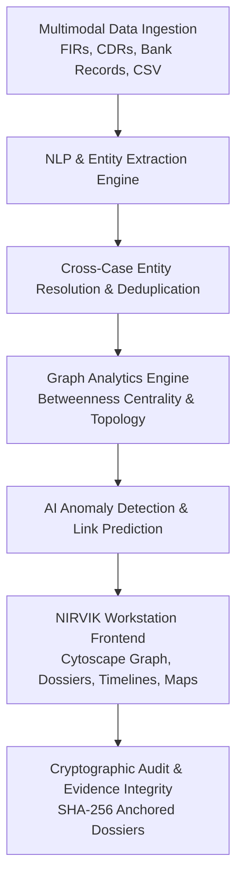

# NIRVIK — AI-Powered Criminal Network Intelligence Platform

<div align="center">
  <h1>NIRVIK</h1>
  <h3>AI-Powered Criminal Network Intelligence & Investigation Decision-Support System</h3>
  <p><i>Architected, Designed, and Implemented for Enterprise Law Enforcement & Intelligence Analysis</i></p>

  <p>
    
    
    
    
    
    
  </p>
</div>

---

## 📖 Table of Contents
1. [Project Overview & Problem Statement](#-project-overview--problem-statement)
2. [Key Capabilities & Architecture](#-key-capabilities--architecture)
3. [Full Repository Directory Structure](#-full-repository-directory-structure)
4. [Technology Stack](#-technology-stack)
5. [Getting Started & Local Setup](#-getting-started--local-setup)
6. [Deployment & Containerization](#-deployment--containerization)
7. [API Endpoints Overview](#-api-endpoints-overview)
8. [Documentation Index](#-documentation-index)

---

## 🎯 Project Overview & Problem Statement

Modern criminal syndicates operate across fragmented jurisdictions and utilize sophisticated operational security. They mask illicit activities through:
- Layered commercial shell companies with nominee directors.
- High-velocity rotating burner handsets and IMEIs.
- Dispersed Hawala networks and structured wire transfers.
- Multi-jurisdictional logistics routes exploiting state boundary handoffs.

### The Problem
Traditional law enforcement intelligence is siloed across disparate state databases, unstructured First Information Reports (FIRs), call detail logs (CDRs), and banking statements. Investigators spend hundreds of manual hours cross-referencing files, frequently missing the **intermediary bridge entities** that hold criminal operations together.

### The NIRVIK Solution
**NIRVIK** is an enterprise AI-powered criminal network intelligence workstation engineered specifically for law enforcement analysts, crime branch investigators, and command personnel. NIRVIK autonomously ingests multi-modal evidence, resolves entities across cases, calculates structural graph centrality, highlights anomalies, and assists investigators in building court-ready, cryptographically verifiable dossiers.

---

## 🏗️ Key Capabilities & Architecture



1. **Topological Graph Intelligence**: Dynamic network graphs with physics-based layout engines (Cytoscape.js), centrality scoring (Betweenness, Degree, Closeness), and one-click intermediate network expansion.
2. **NLP Document Intelligence**: Automated entity extraction (Persons, Organizations, Locations, Vehicles, Weapons) from raw FIRs and interrogation transcripts with confidence ratings.
3. **Cross-Case Linkage**: Automated detection of shared infrastructure (e.g., a phone number active in `CASE-2026-0142` that was previously logged in closed Hawala cases).
4. **Explainable AI (XAI)**: Every anomaly flag and deduction is accompanied by an *Explainability Matrix* and direct citations to physical evidence files.
5. **Cryptographic Chain of Custody**: Every evidence item and audit action is timestamped and anchored with SHA-256 cryptographic verification.
6. **Privacy-Shielded Analysis**: Built-in compliance with Criminal Justice Code §228A for sensitive victim protection in women safety modules.

---

## 📁 Full Repository Directory Structure

```text
NIRVIK/
│
├── frontend/                           # Vite + React 18 + TypeScript SPA Frontend
│   ├── src/
│   │   ├── components/                 # UI components (Graph, Map, Layout, Common)
│   │   ├── context/                    # React Contexts (AuthContext, CaseContext)
│   │   ├── hooks/                      # Custom React Hooks (useAuth, useCase, useNetworkGraph)
│   │   ├── mock/                       # Synthetic intelligence datasets
│   │   ├── pages/                      # 14 Workspace Screen Modules
│   │   ├── services/                   # Centralized API & Auth Client
│   │   ├── types/                      # TypeScript domain interfaces
│   │   ├── App.tsx                     # App routing & provider shell
│   │   └── main.tsx                    # Entry point
│   ├── nginx.conf                      # Production Nginx reverse proxy configuration
│   ├── Dockerfile                      # Multi-stage production container build
│   └── package.json
│
├── backend/                            # FastAPI + Python Async Microservices Backend
│   ├── app/
│   │   ├── api/                        # REST API routes (v1 routers, auth, cases, network)
│   │   ├── core/                       # App settings, logging, and CORS config
│   │   ├── db/                         # Neo4j, Mongo, Redis database drivers
│   │   ├── models/                     # Database & Pydantic domain models
│   │   ├── schemas/                    # Input/Output validation schemas
│   │   ├── security/                   # JWT authentication & password hashing
│   │   ├── services/                   # Modular domain service subpackages
│   │   │   ├── analytics/              # NetworkX & Graph analytics algorithms
│   │   │   ├── anomaly/                # Anomaly detection engines
│   │   │   ├── audit/                  # SHA-256 audit logging
│   │   │   ├── entity_resolution/      # Record linkage & deduplication
│   │   │   ├── evidence/               # Evidence chain of custody service
│   │   │   ├── graph/                  # Neo4j Cytoscape network processing
│   │   │   ├── ingestion/              # Multi-source dataset ingestion
│   │   │   └── nlp/                    # spaCy NER & entity extraction
│   │   └── utils/                      # Helper utilities
│   ├── scripts/                        # Utility & Data Generation Scripts
│   ├── seed/                           # Seed data for Neo4j & MongoDB
│   ├── tests/                          # Pytest unit & integration test suite
│   ├── Dockerfile                      # Production backend container build
│   └── requirements.txt
│
├── data/                               # Ingestion Datasets & Intelligence Artifacts
│   ├── persons.csv                     # Person entity records
│   ├── phones.csv                      # Telecom handset & SIM records
│   ├── vehicles.csv                    # Vehicle registration records
│   ├── locations.csv                   # Geospatial terminal nodes
│   ├── cases.csv                       # Investigation case files
│   ├── cdr.csv                         # Call detail record logs (500+ events)
│   ├── financial_transactions.csv      # Financial transaction logs (200+ events)
│   └── reports/                        # Field investigation report samples
│
├── blockchain/                         # Cryptographic Audit Verification
│   └── README.md                       # Chain of custody & hashing specification
│
├── docs/                               # Architecture & API Specifications
│   ├── architecture.md                 # Technical system architecture blueprint
│   ├── api.md                          # Comprehensive API endpoint reference
│   ├── data-model.md                   # Entity relationship data model schema
│   └── demo-script.md                  # Step-by-step evaluator demonstration flow
│
├── .github/workflows/
│   └── deploy.yml                      # GitHub Actions CI/CD test & build pipeline
│
├── docker-compose.yml                  # Complete multi-container production compose setup
├── DEPLOYMENT.md                       # Comprehensive deployment manual
└── README.md
```

---

## 🛠️ Technology Stack

| Layer | Technologies |
|---|---|
| **Frontend Core** | React 18 / 19, TypeScript 5, Vite 6, Tailwind CSS 3 |
| **Graph Visualization** | Cytoscape.js, Cytoscape-COSE-Bilkent, Cytoscape-FCose |
| **Geospatial Intelligence** | Leaflet.js, React-Leaflet |
| **Backend Core** | Python 3.12, FastAPI, Pydantic v2, Uvicorn, Pytest |
| **Databases & Stores** | Neo4j 5 (Graph DB), MongoDB 7, Redis 7 (Cache), MinIO (Storage) |
| **NLP & Graph Analytics** | spaCy NER, NetworkX, APOC Graph Data Science |
| **DevOps & Deployment** | Docker, Nginx, Docker Compose, GitHub Actions CI/CD |

---

## ⚡ Getting Started & Local Setup

### Prerequisites
- **Node.js**: v18.x or higher
- **Python**: 3.10 or higher
- **Docker**: Docker Engine 24.0+ (for containerized setup)

### Option A: Running with Docker Compose (Recommended)
```bash
git clone https://github.com/AdityaP116/NIRVIK.git
cd NIRVIK

# Launch all backend, database, and frontend containers
docker compose up -d --build
```
Access the application at `http://localhost`.

### Option B: Local Manual Development Setup

1. **Start Backend Server**:
   ```bash
   cd backend
   python -m venv .venv
   # Windows: .venv\Scripts\activate | Linux/macOS: source .venv/bin/activate
   pip install -r requirements.txt
   uvicorn app.main:app --reload --port 8000
   ```

2. **Generate Synthetic Data (Optional)**:
   If you need to re-generate the intelligence CSV datasets:
   ```bash
   # From the backend directory
   python scripts/export_csv_data.py
   ```
   *Note: This creates mock Persons, Phones, Vehicles, CDRs, and Cases in `../data/`.*

3. **Start Frontend Client**:
   ```bash
   cd ../frontend
   npm install
   npm run dev
   ```
   Navigate to `http://localhost:5173` in your browser.

4. **Run Test Suites**:
   ```bash
   # Backend tests
   cd ../backend && python -m pytest

   # Frontend production build check
   cd ../frontend && npm run build
   ```

---

## 🚀 Deployment & Containerization

NIRVIK is pre-configured for production deployment:
* **Single Command Compose**: `docker compose up -d --build`
* **Nginx Reverse Proxy**: Automatic single-page fallback routing and static file caching.
* **CI/CD Pipeline**: GitHub Actions (`.github/workflows/deploy.yml`) executing backend unit tests and frontend production compilation automatically.
* For full cloud deployment steps (GCP Cloud Run, AWS ECS, DigitalOcean), see [DEPLOYMENT.md](DEPLOYMENT.md).

---

## 📡 API Endpoints Overview

| Method | Endpoint | Description |
|---|---|---|
| `GET` | `/health` | Server health check endpoint |
| `POST` | `/api/v1/auth/login` | Authenticate officer session and issue JWT token |
| `GET` | `/api/v1/cases/` | Retrieve active investigation cases |
| `GET` | `/api/v1/network/{case_id}` | Generate Cytoscape graph nodes & edges for a case |
| `POST` | `/api/v1/search/` | Full-text & multi-attribute intelligence search |
| `GET` | `/api/v1/audit/verify/{case_id}` | Cryptographic audit trail verification |

For the complete API documentation, refer to [docs/api.md](docs/api.md).

---

## 📚 Documentation Index
- [Architecture Specifications](docs/architecture.md)
- [API Reference Guide](docs/api.md)
- [Data Model & Schema Reference](docs/data-model.md)
- [Evaluator Demonstration Script](docs/demo-script.md)
- [Blockchain Audit Logging](blockchain/README.md)
- [Deployment & Operations Guide](DEPLOYMENT.md)

---

<div align="center">
  <p><b>NIRVIK Criminal Network Intelligence Workstation</b></p>
  <p>Law Enforcement & Intelligence Decision Support System</p>
</div>
