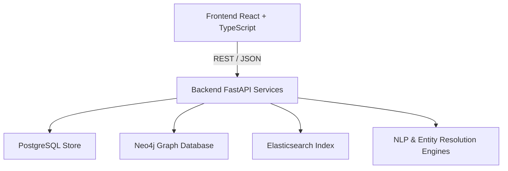

# NIRVIK — System Architecture

## Architecture Overview
NIRVIK is an Enterprise Law Enforcement & Intelligence Platform designed for multi-source data fusion, entity resolution, graph analytics, and AI-driven investigative insights.

## Key Layers
1. **Frontend**: Vite + React 18, Cytoscape.js for knowledge graphs, Leaflet.js for geospatial mapping.
2. **API & Services Layer**: FastAPI microservices handling ingestion, NLP NER, Graph traversal, Anomaly detection, and Cryptographic Audit logging.
3. **Storage Layer**:
   - **Neo4j**: High-performance graph database for multi-hop entity relationship paths.
   - **PostgreSQL**: Relational storage for cases, users, audit logs, and evidence metadata.
   - **Elasticsearch / Vector DB**: Full-text search and semantic retrieval over FIRs & intelligence documents.
